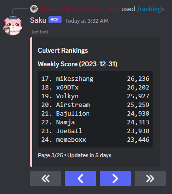
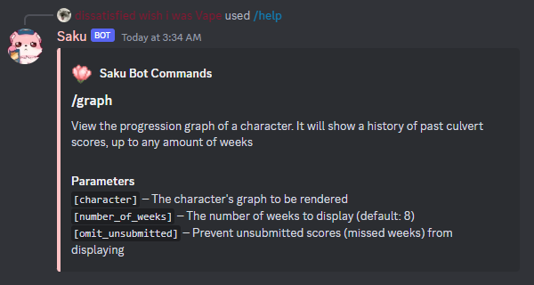
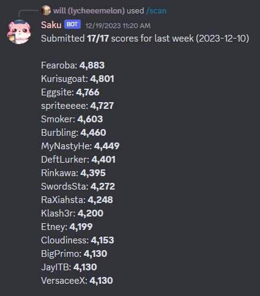

  <ul>
    

        <h1 style="display: inline-block;">
          Saku
        </h1>
    

        

      
    

        

        <h3 style="display: inline-block;">
          A Discord Bot tailored towards Saku's community. It provides culvert score tracking, general character statistics, as well as fun commands!
        </h3>
    

    

  </ul>

<h2 align="center">Profile</h2>

  

<h2 align="center">Graph</h2>

  

<h2 align="center">Rankings</h2>

  

<h2 align="center">Help</h2>

  

<h2 align="center">Scan</h2>

  

  <ul>
    

    

        <h2 style="display: inline-block;">
          And many more!
        </h1>
    

  </ul>

