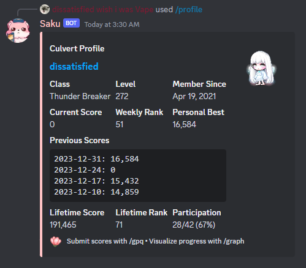
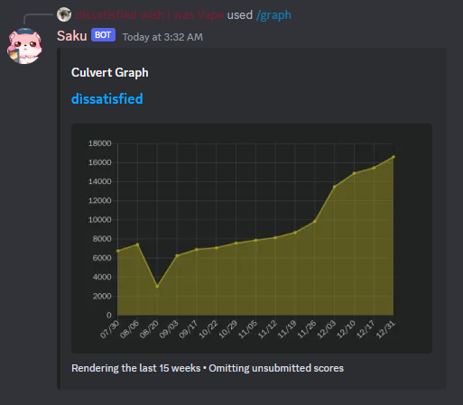
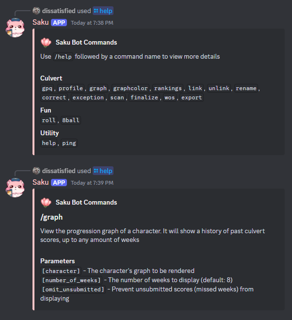
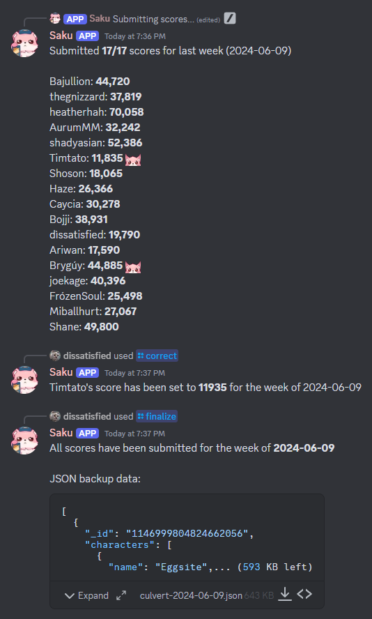

  <ul>
    

        <h1 style="display: inline-block;">
          Saku
        </h1>
    

        

      
    

        

        <h3 style="display: inline-block;">
          A Discord Bot tailored for Saku's community.
        </h3>
                 <h4 style="display: inline-block;">
                    As a member, make use of commands such as /profile and /graph which provide you with detailed character and culvert score statistics. You can also view the overall scores with /rankings, or use fun commands such as /8ball to get some insight!
        </h4>
                            <h4 style="display: inline-block;">
                    As an administrator, work comfortably behind the scenes. Manage users and characters (CRUD), scan and input weekly scores, view top secret data, and more. 
        </h4>
    

    

  </ul>

<h2 align="center">Profile</h2>

  

<h2 align="center">Graph</h2>

  

<h2 align="center">Rankings</h2>

  

<h2 align="center">Help</h2>

  

<h2 align="center">Scan (and related commands)</h2>

  

  <ul>
    

    

        <h2 style="display: inline-block;">
          Check the code to see more of the commands and how they work!
        </h1>
    

  </ul>

